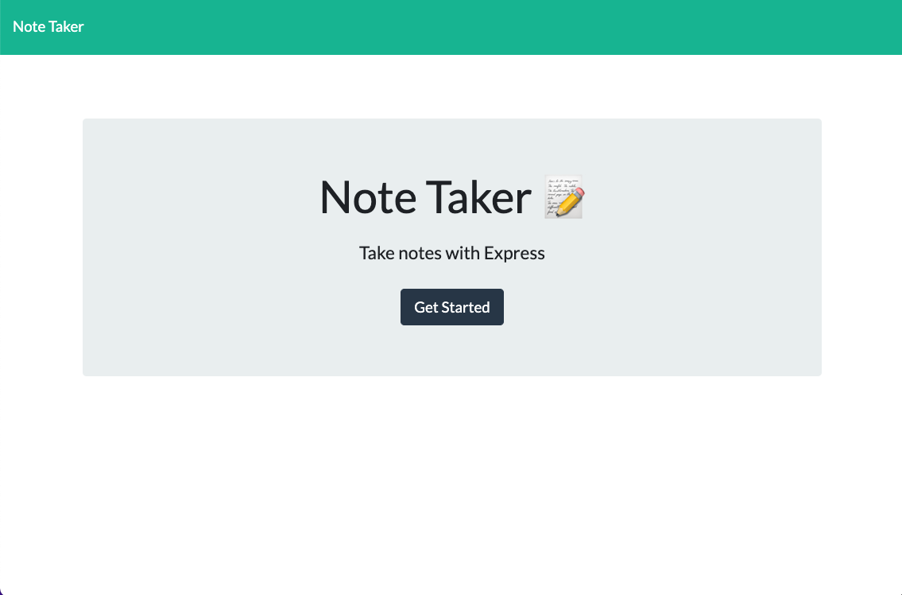
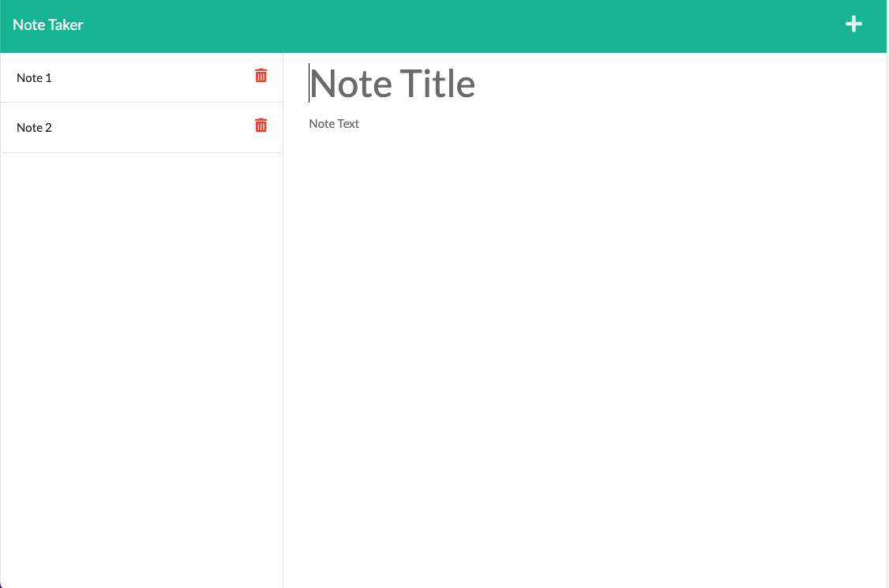

# Note Taker

## Description
This project was built to be able to write, save, and delete notes. On the landing page, there is a button, "Get Started", that includes a link to the notes page. On the notes page, existing notes are listed in the column on the left and empty input fields are presented in the column on the right. A save icon appears once a title and text have been entered. A user can save a note by clicking on the save icon and have the note appear in the left column with other existing notes. Existing notes can be clicked on to view that note in the right column. When the add icon on the top right is clicked, the user is presented with the empty input fields to write a new note.

## Technologies Used
- JavaScript
- Git
- GitHub
- Node.js
- Express.js

## Usage
On the landing page, click 'Get Started' to be redirected to the notes page.

Enter a title and text in the empty input fields to write a new note.

To save the note, click on the save icon that will appear on the top right when a title and text have been entered.

To view existing notes, click on an existing note in the left column to be presented with that note in the right column.

To write a new note, click on the add icon to be presented with empty input fields.

To delete an exisitng note, click on the delete icon next to the title of the note that is to be deleted.

## License
Please refer to the LICENSE in the repo.

## Author Links
[GitHub](https://github.com/ncguan)
